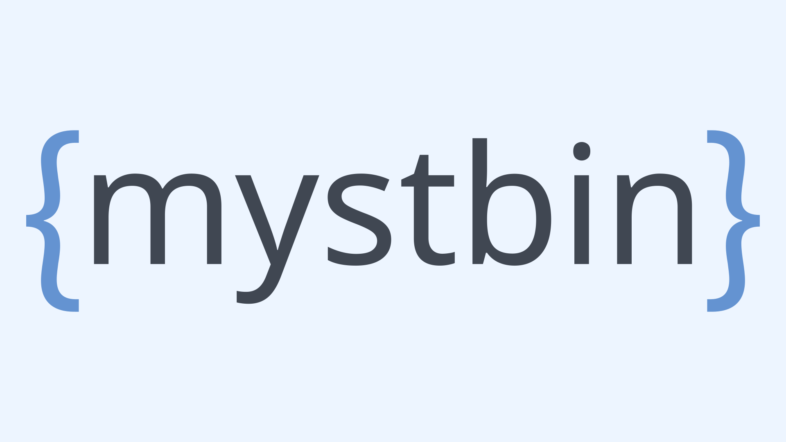

    
    
Easily share your code or text with syntax highlighting and themes for readability.

    
<b>NOTE:</b> This software is under heavy development and subject to change. At this time it is currently not supported.

     
    
A hosted version of this can be found at <a href="https://beta.mystb.in">beta.mystb.in</a>

     
    
    
    

    
    

# Installation

### TBD
At this time we currently do not support this software as it is under heavy development.
